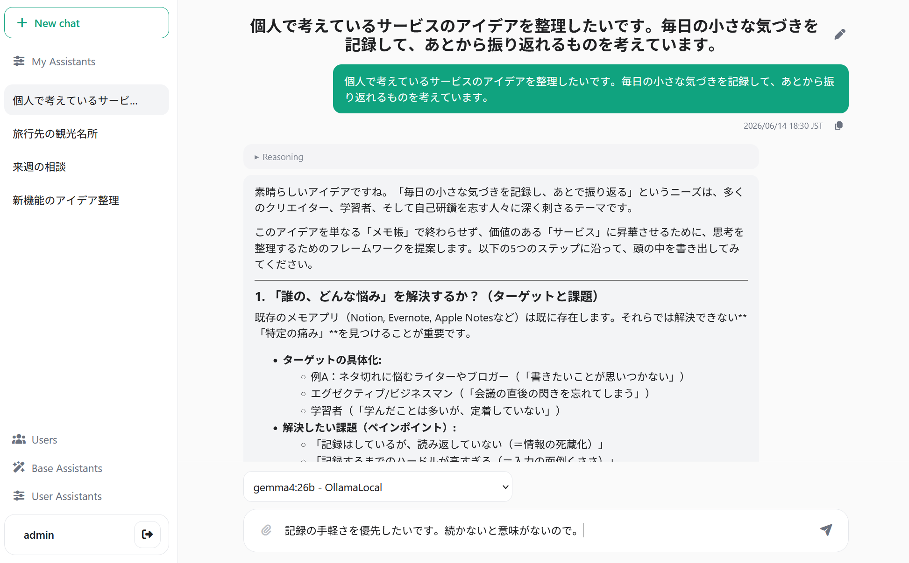
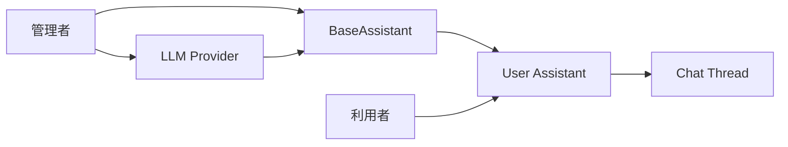

# prem-relay-ai-chat

[](https://github.com/caumie/chat/actions/workflows/python-tests.yml)

[](LICENSE)

小規模なグループで OpenAI API と OpenAI 互換 API を共有するための、Python 製セルフホスト AI チャットです。

管理者がユーザー、LLM 接続先、利用可能なモデルと基本設定を用意し、利用者はその範囲内で自分用の Assistant を作成できます。大規模な AI プラットフォームではなく、数人で理解しながら運用できる小さな構成を重視しています。

- Pythonだけで起動 — Node.jsや別途構築するデータベースは不要
- API キーを各利用者へ直接配布せず、管理者が接続先を一元管理
- 管理者定義の BaseAssistant をもとに、利用者が用途別の Assistant を作成
- OpenAI Responses API と Chat Completions 互換 API に対応
- SSE ストリーミング、Reasoning 表示、ファイル添付、会話履歴に対応



## このアプリが向いているケース

- 家族、個人事業、店舗、社内の小部門など、数人で AI モデルを共有したい
- API キーや接続先を管理者がまとめて管理したい
- 利用可能なモデル、プロンプト、添付ファイル形式を管理者側で制御したい
- 利用者ごとに名前や追加プロンプトを設定した Assistant を持たせたい
- Python と SQLite で理解・運用できる小さなセルフホスト環境が欲しい

次の用途は対象としていません。

- 誰でも登録できる公開 AI サービス
- 数百人規模の組織や、細かな権限ロールを必要とする環境
- 複数サーバーによる高可用性構成
- RAG、MCP、Web 検索、画像生成などを統合した多機能 AI プラットフォーム

## Quick Start

### 必要なもの

- Python 3.13
- [uv](https://docs.astral.sh/uv/)
- OpenAI API、または OpenAI Chat Completions 互換 API

### 1. インストール

```bash
git clone https://github.com/caumie/chat.git
cd chat
uv sync
```

### 2. 設定ファイルを作成

```bash
cp data/app_config.example.json data/app_config.json
cp data/connection_providers.example.json data/connection_providers.json
```

Windows では、同名のファイルをエクスプローラーまたは PowerShell でコピーしてください。

`data/app_config.json` の `session_secret` は、推測されにくい値へ必ず変更してください。

```bash
uv run python -c "import secrets; print(secrets.token_urlsafe(48))"
```

続いて、`data/connection_providers.json` に利用する LLM 接続先を設定します。

```json
{
  "version": 1,
  "providers": [
    {
      "id": "openai",
      "name": "OpenAI",
      "api_mode": "responses",
      "base_url": "https://api.openai.com/v1",
      "api_key": "replace-with-your-openai-api-key",
      "allowed_models": ["gpt-5", "gpt-5-mini"],
      "default_options": {
        "temperature": 0.7
      }
    }
  ]
}
```

設定ファイルには API キーが含まれます。リポジトリへコミットしないでください。

### 3. 起動

```bash
uv run uvicorn src.app:build_app --factory --host 127.0.0.1 --port 8000
```

ブラウザで `http://127.0.0.1:8000/setup/admin` を開き、最初の管理者ユーザーを作成します。

その後は次の順で利用を開始できます。

1. 管理者としてログインする
2. 利用者を作成する
3. BaseAssistant を作成する
4. 必要に応じて利用者が自分用 Assistant を作成する
5. Assistant を選び、チャットを開始する

## BaseAssistant と User Assistant

prem-relay-ai-chat では、管理者の管理範囲と利用者の個別設定を分けています。



### BaseAssistant

管理者が作成する、Assistant の土台です。

- 接続先 Provider
- モデル
- System Prompt
- User Prompt
- 会話へ含める最大履歴件数
- 生成オプション
- ファイルアップロードの可否
- 許可するファイル拡張子

### User Assistant

利用者が BaseAssistant をもとに作成する、自分用の Assistant です。

- 表示名
- 用途の説明
- 利用者固有の追加プロンプト

管理者は利用可能なモデルやファイル方針を管理しながら、利用者には用途別の個別化を許可できます。

## 主な機能

| 領域 | 内容 |
|---|---|
| ユーザー管理 | ユーザーの作成、更新、停止、削除、管理者の切り替え |
| LLM 接続 | 複数 Provider、Base URL、API Key、モデル許可リスト、既定オプション |
| Assistant | BaseAssistant と利用者用 Assistant、System/User Prompt、履歴件数、生成設定 |
| チャット | スレッド形式、SSE による逐次表示、Reasoning 表示、生成停止、返答のコピー |
| 添付ファイル | Assistant ごとの許可、拡張子制限、ファイルメタデータの保存 |
| 永続化 | SQLite によるユーザー、Assistant、スレッド、メッセージの保存 |

## LLM 接続方式

`data/connection_providers.json` の `api_mode` には、次のいずれかを指定します。

| `api_mode` | 用途 |
|---|---|
| `responses` | OpenAI Responses API |
| `chat_completions` | Ollama などの OpenAI Chat Completions 互換 API |

OpenAI 互換 API は、実装ごとにストリーミングイベント、Reasoning、添付形式、生成オプションなどが異なります。そのため、互換 API のすべての機能を一律に保証するものではありません。

モデルごとにファイル添付の可否と許可拡張子を設定できます。たとえば、画像対応モデルには `jpg`、`png`、`webp` を許可し、テキスト中心のモデルには `txt`、`md`、`pdf` のみを許可するといった運用ができます。実際に処理できる形式は、接続先 Provider とモデルの能力にも依存します。

## データ、プライバシー、公開方法

本アプリの主要データは、ローカルの `data` ディレクトリへ保存されます。

| データ | 保存場所・扱い |
|---|---|
| ユーザー、Assistant、会話履歴 | SQLite |
| 添付ファイル | `data/uploads` |
| 添付メタデータ | SQLite。元ファイル名、保存パス、Content-Type、サイズ、SHA-256 など |
| LLM 接続設定と API キー | `data/connection_providers.json` |
| アプリ設定 | `data/app_config.json` |

チャット履歴や添付ファイルは、選択した Provider で応答を生成する際に外部 API へ送信される場合があります。ローカルへ保存されることと、推論処理が常にローカルで完結することは同じではありません。

設定ファイル、SQLite、添付ファイル、バックアップには機密情報が含まれる可能性があります。OS のファイル権限を適切に設定し、共有場所へ不用意に置かないでください。

本アプリをインターネットへ直接公開する構成は推奨しません。外部から利用する場合は、HTTPS、アクセス制限、リバースプロキシ、ファイアウォールなどを組み合わせてください。

簡単なバックアップでは、アプリを停止してから `data` ディレクトリ全体を保存してください。

## Docker

最初に設定ファイルを用意します。

```bash
cp data/app_config.example.json data/app_config.json
cp data/connection_providers.example.json data/connection_providers.json
```

`data/app_config.json` の秘密値と `data/connection_providers.json` の接続先を編集した後、次のコマンドを実行します。

```bash
docker compose up -d --build
```

起動後は <http://localhost:8000> を開きます。初回起動時に管理者設定画面が表示されます。

DB、設定、ログ、添付ファイルなどの可変データは、bind mount されたホスト側の `data/` に保存されます。

停止する場合も `data/` の内容は削除されません。バックアップ時は停止後に `data/` 全体を保存してください。

```bash
docker compose down
```

標準構成ではアプリ本体をイメージへ COPY し、単一 Worker、非 root ユーザーで起動します。ホストから bind mount するのは可変データを置く `data/` だけです。

## Architecture highlights

このプロジェクトは、機能数よりも、外部 API、永続化、HTTP 接続の境界を明確に扱うことを重視しています。

### 1. HTTP 接続と応答生成の寿命を分離

Assistant Message の Placeholder を SQLite へ保存してから応答生成を開始します。ブラウザとの SSE 接続が切れても、HTTP 接続と生成処理を同じ寿命として扱いません。

生成中の Job はオンメモリで管理し、完了・失敗・停止時に DB 上の状態を収束させます。SSE 再接続時には保存済みの最新全文を返した後、以降の差分を配信します。

主な実装:

- `src/service/response_service.py`
- `docs/spec.md`

### 2. Provider ごとの差異を LLM 境界で吸収

OpenAI Responses API と Chat Completions 互換 API の応答を、アプリ内部の共通イベントへ変換します。Reasoning、Token 設定、添付入力などの差異を、画面やユースケースへ広げない方針です。

主な実装:

- `src/llm/client.py`
- `src/llm/input_builder.py`

### 3. 副作用の順序を Usecase に集約

HTTP Route は永続化手順を直接持たず、利用者操作、業務判断、ファイル保存、Commit Point を Usecase に置いています。

添付ファイルは SQLite とファイルシステムをまたぐため、保存途中で失敗した場合の後始末もユースケース境界で扱います。

主な実装:

- `src/usecase/`
- `src/infrastructure/`
- `docs/design.md`

## 技術スタック

- Python 3.13
- FastAPI / Uvicorn
- Jinja2 / HTMX / JavaScript
- SQLite
- OpenAI Python SDK
- Server-Sent Events
- uv
- pytest
- Pyright strict

SPA を前提とせず、Jinja2 と HTMX を利用することで、フロントエンドの状態管理とビルド構成を小さくしています。

## 開発

### ローカル開発

```bash
uv sync
uv run uvicorn src.app:build_app --factory --reload
```

### Docker 開発環境

VS Code でこのリポジトリを開き、`Dev Containers: Reopen in Container` を実行してください。
開発用の Docker 定義は `.devcontainer/` に集約してあります。

開発用コンテナはアプリを自動起動しません。`sleep infinity` で待機するので、必要なときにコンテナ内でコマンドを実行します。

```bash
uv run pytest
uv run pyright
```

### テストと型チェック

```bash
uv run pytest
uv run pyright
```

## 現在の制約

本プロジェクトは、小規模な単一サーバー運用へ範囲を絞っています。

- 公開サインアップはありません。
- 大規模組織向けの細かな権限ロールはありません。
- 応答生成 Job はオンメモリであり、永続 Job Queue は使用しません。
- サーバー再起動をまたいだ途中 Stream の復元は行いません。
- SSE の厳密な再開位置管理は行いません。
- 複数インスタンス向けの分散 Lock、Lease、Fencing は扱いません。
- 複数タブや外部 Client を含む完全な二重送信防止は保証しません。

これらは未完成機能の一覧ではなく、構成を小さく保つために現在の対象外としている範囲です。

## AI-assisted development

本プロジェクトでは、設計の検討、実装補助、Review に AI を利用しています。生成された内容はそのまま採用せず、作者が設計判断を行い、Test、Pyright strict、実行確認を通して検証しています。

## License

[MIT License](LICENSE)
